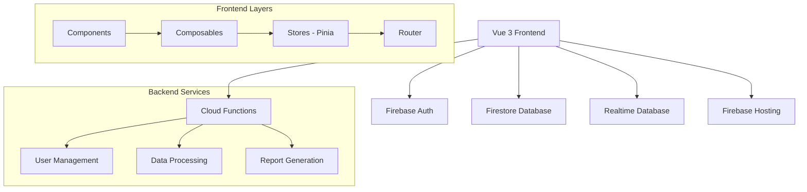

# 🏢 HT Admin Takip - Enterprise Operasyon Yönetim Sistemi

Modern Vue.js 3 ve Firebase teknolojileri ile geliştirilmiş, enterprise seviyesinde operasyon yönetim uygulaması.


## ✨ Özellikler

### 🎯 **Ana Modüller**

- **📊 Dashboard & Raporlama** - Real-time analytics ve KPI tracking
- **👥 Kullanıcı Yönetimi** - Role-based access control
- **🏢 Tesis Yönetimi** - Multi-facility operations
- **📋 Veri Girişi** - 8 farklı operasyon modülü
- **🎲 Çekiliş Sistemi** - Animasyonlu, rule-based lottery
- **📱 WhatsApp Entegrasyonu** - Template-based messaging

### 🎨 **Kullanıcı Deneyimi**

- **8 Farklı Tema** - 4 color scheme × light/dark mode
- **📱 Progressive Web App** - Offline capability
- **🔄 Real-time Updates** - Live data synchronization
- **📊 Interactive Charts** - Chart.js integration
- **🌐 Multi-language Ready** - i18n infrastructure

### 🛡️ **Güvenlik & Performance**

- **🔐 Multi-layer Authentication** - Firebase Auth + Custom Claims
- **⚡ Optimized Queries** - Firestore indexes
- **🚀 Modern Build System** - Vite + PWA
- **🔄 Real-time Presence** - Online user tracking

## 🏗️ **Architecture Overview**



## 🚀 **Quick Start**

### Ön Gereksinimler

- **Node.js** 20+
- **npm** veya **yarn**
- **Firebase CLI** `npm install -g firebase-tools`

### Kurulum

```bash
# Repository'yi klonla
git clone https://github.com/your-username/ht-admin-app.git
cd ht-admin-app

# Dependencies'leri yükle
npm install

# Firebase Functions dependencies
cd functions
npm install
cd ..

# Environment variables'ları ayarla
cp .env.example .env
# .env dosyasını Firebase config ile düzenle
```

### Geliştirme

```bash
# Development server'ı başlat
npm run dev

# Firebase emulators'ı başlat (opsiyonel)
firebase emulators:start

# Kod kalitesi kontrolü
npm run lint

# Testleri çalıştır
npm run test
```

### Production Build

```bash
# Production build
npm run build

# Build'i önizle
npm run preview

# Firebase'e deploy et
npm run deploy
```

## 📁 **Proje Yapısı**

```
ht-admin-app/
├── 📁 src/
│   ├── 📁 components/          # Reusable UI components
│   │   ├── 📁 charts/         # Chart components
│   │   ├── 📁 common/         # Common UI elements
│   │   ├── 📁 DataEntry/      # Data entry modules
│   │   └── 📁 layout/         # Layout components
│   ├── 📁 composables/         # Vue composables
│   ├── 📁 stores/             # Pinia stores
│   ├── 📁 router/             # Vue Router config
│   ├── 📁 views/              # Page components
│   ├── 📁 utils/              # Utility functions
│   └── 📁 assets/             # Static assets
├── 📁 functions/              # Firebase Cloud Functions
├── 📁 public/                # Public assets
└── 📄 config files           # Build & dev configs
```

## 🔧 **Teknoloji Stack**

### Frontend

- **Vue.js 3** - Progressive JavaScript framework
- **Pinia** - State management
- **Vue Router 4** - Client-side routing
- **Vite** - Build tool & dev server
- **Chart.js** - Data visualization

### Backend & Database

- **Firebase Authentication** - User management
- **Cloud Firestore** - NoSQL database
- **Firebase Realtime Database** - Real-time features
- **Cloud Functions** - Serverless backend
- **Firebase Hosting** - Static hosting

### Development Tools

- **ESLint** - Code linting
- **Prettier** - Code formatting
- **Vitest** - Unit testing
- **Husky** - Git hooks

## 👥 **Kullanıcı Rolleri**

| Role            | Permissions | Description                       |
| --------------- | ----------- | --------------------------------- |
| **Kurucu**      | Full Access | System founder, all permissions   |
| **Super Admin** | Management  | User & facility management        |
| **Kullanıcı**   | Limited     | Assigned facility operations only |

## 📊 **Veri Modülleri**

### Operasyon Modülleri

1. **Tesise Gelen** - Facility guest tracking
2. **Davet Girişi** - Invitation management (30-slot system)
3. **Geliş Yönetimi** - Arrival management
4. **Çekiliş Paneli** - Animated lottery system
5. **Dağıtım Paneli** - Distribution management
6. **Masa Sayımı** - Table count tracking
7. **Otobüs** - Transportation management
8. **Fiş Girişi** - Voucher system

### Ayar Modülleri

- **Kullanıcı Yönetimi** - User roles & permissions
- **Tesis Yönetimi** - Facility CRUD operations
- **Grup Yönetimi** - Sales group management
- **Ekip Yönetimi** - Team assignments
- **WhatsApp Şablonları** - Message templates

## 🎨 **Tema Sistemi**

4 ana tema, her biri light/dark mode ile:

- **Kurumsal Mavi** (Default)
- **Mercan & Çelik Mavisi**
- **Krem & Terracotta**
- **Modern Kömür & Turkuaz**

## 🔐 **Güvenlik**

### Authentication

- Firebase Authentication
- Google OAuth integration
- Email/Password authentication
- Custom user claims

### Authorization

- Role-based access control
- Firestore security rules
- Cloud Functions validation
- Input sanitization

## 📈 **Performance**

### Optimizations

- Lazy loading components
- Firestore query optimization
- PWA caching strategies
- Bundle size optimization
- Real-time query efficiency

### Monitoring

- Performance metrics
- Error tracking ready
- User analytics ready
- Bundle analysis tools

## 🧪 **Testing**

```bash
# Unit tests
npm run test

# Component tests
npm run test:components

# E2E tests (when implemented)
npm run test:e2e

# Coverage report
npm run test:coverage
```

## 🚀 **Deployment**

### Firebase Hosting

```bash
# Build & deploy
npm run deploy

# Deploy only hosting
firebase deploy --only hosting

# Deploy only functions
firebase deploy --only functions
```

### Environment Variables

```bash
# .env file structure
VITE_FIREBASE_API_KEY=your_api_key
VITE_FIREBASE_AUTH_DOMAIN=your_domain
VITE_FIREBASE_PROJECT_ID=your_project_id
# ... other Firebase config
```

## 🤝 **Contributing**

1. Fork the repository
2. Create feature branch: `git checkout -b feature/amazing-feature`
3. Commit changes: `git commit -m 'Add amazing feature'`
4. Push to branch: `git push origin feature/amazing-feature`
5. Open a Pull Request

### Development Guidelines

- Follow ESLint & Prettier rules
- Write unit tests for new features
- Update documentation
- Use conventional commits

## 📄 **License**

This project is private and proprietary.

## 🆘 **Support**

- 📧 Email: support@company.com
- 📚 Documentation: [Wiki](link-to-wiki)
- 🐛 Issues: [GitHub Issues](link-to-issues)

## 🙏 **Acknowledgments**

- Vue.js community
- Firebase team
- Open source contributors

---

Made with ❤️ by [Orhan Engin OKAY]
